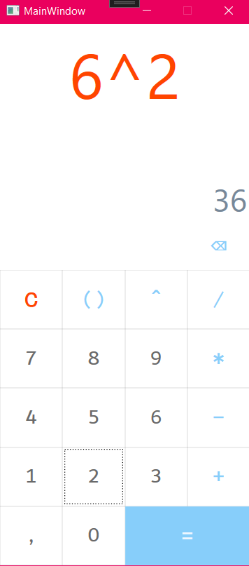

# Simple-WPF-Calculator

In this project, I have made modifications to a simple WPF calculator that was originally developed by dariuszdbr and can be found on GitHub at https://github.com/dariuszdbr/CalculatorWpfMVVM.  

The main addition I made was implementing a power operator. The project currently uses the `math.mxparser` library to handle mathematical operations by parsing expressions and evaluating them based on regular expressions defined in the `CalculatorModel.cs` file.  

To enable the power operator, I updated the regular expression in the Insert function of the CalculatorModel.cs file. Specifically, I modified the regular expression from `[+\-*/%,]` to `[+\-*/,^]` so that it recognizes 
and calculates power inputs.  

The next step in this project is to update the user interface (UI) to reflect the changes.
This involves changing the button from `"ButtonPercent"` to `"ButtonPower"`, removing its listener, and updating its content accordingly.  

Here is an image showcasing the updated program with the implemented power operator:  

